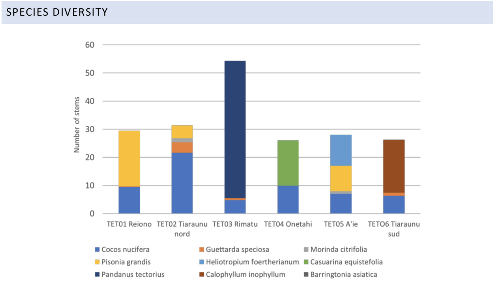

# Summary

This script calculates the land habitat score. Because a long term goal for Tetiaroa is to restore abandoned coconut plantation areas to native vegetation, the status score of the land habitat will be the ratio of native to non native habitat that exists now on the motus. 

Data used for this goal comes from a 2018 forest monitoring project undertaken by researchers from the University of French Polynesia and Oxford University (McIntosh et al., 2018) in addition to the CASUP_vegetation_flora_JYM_2015.docx found in the dropbox. Because we are not able to access to database online, these documents simply help us understand what vegetation is dominant on each motu. We will assign scores based on whether the motu is dominated by native vegetation or by coconut grove. 

Each motu will receive a score, and then the final score will be calculated using the average weighted by area of the motu. 

[insert cool tree image from Carol here]

# Set up
```{r setup, include=FALSE}
knitr::opts_chunk$set(echo = TRUE)


library(tidyverse)
library(sf)
library(here)
library(janitor)

source(here('workflow/R/common.R'))

#file paths
goal     <- 'hab'
scenario <- 'v2020'
dir_goal      <- file.path(here('prep/bd',goal, scenario))
dir_goal_anx  <- file.path(dir_anx, goal, scenario)
dir_github    <- '~/github/tet-prep'

#read in habitat data

tet_hab <- read_csv(file.path(dir_goal, "_raw_data/tet_habitats_casup.csv")) %>%
  clean_names()
```

# Methods

## Assigning habitat scores

Looking at the CASUP habitat document, we can see that there are four motus that have "very dense coco forest". All four also have another type of vegetation. Do some exploring to come up with the best scoring scheme: 

```{r}

#lets see what vegetation types are on the "pristine" atolls

tet_pristine <- tet_hab %>% 
  filter(str_detect(motu, pattern = "AIE") | str_detect(motu, pattern = "TAR") | str_detect(motu, pattern = "TAI"))

#looks like there are only thickets and native forest. These habitats will get a score of 1. 

tet_coco <- tet_hab %>%
  filter(str_detect(motu, pattern = "TIA") | str_detect(motu, pattern = "HIR") | str_detect(motu, pattern = "HOR") | str_detect(motu, pattern = "RIM"))
  
#there are a lot of habitats - come back to this if giving them a score of zero seems too harsh

scored_motus <- c("AIE","TAR","TAI","TIA","HIR","HOR","RIM")

need_score <- tet_motus %>% 
  filter(abb %!in% scored_motus)

```

We'll cross reference what the CASUP document suggests with what the 2017 study suggests. If there are any major conflicts, we'll default to the to forest study since it is more recent. 

The 2017 study simply indicates which tree species in dominant in each plot. I think it is safe to assume that the study tried to choose plots that were representative of the whole motu. Furthermore, we can cross reference each species of tree with Tetiaroa Society since they have a list of plants on the website with more details, including if it is native, and how it contributes to the island ecosystem. Note: if the tree is designated on the Tetiaroa website as 'Polynesian Introduction' we'll still consider it native.

Below are the results from the study: 

| Motu | Dominant species | Native? | Notes |
| :----- | :--------- | :----- | :-------------------|
| Reiono | Pisonia grandis / Cabbage tree | yes | Important nesting site, helps protect against storm surge |
| Tiaraunu N | Cocos nucifera / Coconut palm | no | Coco plantations have made motus more vulnerable to storm surge and coastal erosion
| Tiaraunu S | Callophyllum inophyllum / Tamanu | yes | Introduced by native Polynesians, oil from its fruit used for many purposes |
| Rimatu | Pandanus tectorius / Screwpine | yes | Key food staple for native atoll inhabitants, used also for medicinal purposes and weaving | 
| Onetahi | Casuarina equisetifoilia / Ironwood | yes | Introduced by native Polynesians, can grow to 100 ft tall, symbol of the war god 'Oro |
| A'ie | Mixed forest | yes | No further details |

The image below (screen shot from the report) displays the proportion of each species in these plots graphically:




We get some additional detail from this. First, it appears that Tiaraunu has some coastal "native" vegetation, as one plot was dominated by coco groves and the other is dominated by a native trees, yet still had a substantial proportion of coconut trees (last bar on the graph). We'll therefore increase its score from 0 to 0.3. Second, this report and the Tetiaroa society suggest that Reiono is actually comprised mostly of dense *Pisonia grandis* forest, which is native and has many ecosystem benefits. Given we are interested in scoring habitats for biodiversity, this merits a higher score than 0.5, so we'll increase it to 0.6 based on the bar graph showing about 2/3 native forest, 1/3 coco forest. It seems like Rimatu also has important native plants (Screwpine), so it seems appropriate to score this motu as 0.6 as well. Lastly, the plot on Onetahi was mostly large native trees, but still had a pretty high proportion of coconut groves. We also know this motu has built environment, so seems best to score it similarly to Tiaraunu.


The motus we have yet to score, and that are not addressed in McIntosh et al. (2018) are:   

- **Tauvine:** mostly Pemphis thicket, will get a score of 1 since this is a native land cover type
- **Ahuroa:** this is a tiny motu (the fourth smallest). We don't have details for it, but is is right next to Tauvine, so we'll assume it has a similar vegetation make up and get the same score of 1
- **Honuea:** only has cadium marsh, and *Pandanus* forest, both of which are native habitats. Score of 1.


To summarize, our final scoring scheme is as follows: 

| Habitat | Score
| :--------------- | :-----: |
| Only native vegetation | 1 |
| Native vegetation dominant, but some coconut grove | 0.6 |
| Coconut grove or altered landscape dominant, some vegetation | 0.3 |
| Dense coconut grove present, lacking details on native vegetation | 0 | 

```{r}

#this can always be adjusted

tet_hab_score <- tet_motus %>%
  mutate(
    abb = as.character(abb)
  ) %>% 
  mutate(
    score = case_when(
      abb %in% c("AIE","TAR","TAI","TAU","AHU","HON") ~ "1",
      abb %in% c("HIR","HOR") ~ "0",
      abb %in% c("TIA", "ONE") ~ "0.3",
      abb %in% c("REI", "RIM") ~ "0.6",
      TRUE ~ "0"
    )
  )

```

Next step is to use the areas of the motus to weight the average score. That proportion will be the weight applied to that motus score. 

Given we do not have any temporal data indicating change over time, and the fact that we are using two sources from 2015 and 2017, respectively, we can probably just assume the composition of the motus has not changed much since 2020. We'll still create a df with every year to save to the toolbox, in case this is updated in the future. 


```{r}

#find the weighted average
hab_stat <- tet_hab_score %>% 
  mutate(
    score = as.numeric(score),
    weighted_score = weighted.mean(score, area_km2)
  )

years <- seq(2014,2020,1)

#create final data frame
land_hab_status <- data.frame(
  region_id = rep(1, length(years)),
  hab_type = rep("land", length(years)),
  status = rep(unique(hab_stat$weighted_score), length(years)),
  year = years
)

#write out this draft version to int folder for now

write_csv(land_hab_status, file.path(dir_goal, "output/land_hab_status.csv"))

#write to toolbox


```


Draft score for land habitat, 2020 is the number in the score column in `land_hab_status` data frame. 

## Using spatial extent data

If we had data showing the extent of each vegetation type, we could instead use a method assessing area covered by native habitat versus coconut habitat. 