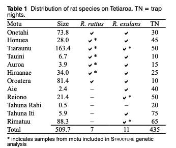

# Summary 

For the invasive species pressure layer, we will take a very simple approach based on where invasive species exist. We know from the documentation provided by the Tetiaroa Society that there are 5 main invasive species groups they are trying to eradicate: two species of rats, mosquito, biting flies, and ants. We know which motus these have been successfully eliminated off of, so we can quantify which areas have which species. So a perfect score would be an area with 0 invasive species, and the lowest score would be an area with all the invasive species. Scores will be assigned by motu and then weighted by area of the motu. 

One challenging thing is that we do not know precise timing for these species, making it difficult to know exactly the trend with invasive species. 

Also, there are other invasive species that are recognized on the island, such as snails, geckoes, weeds and plant pathogens. These are listed in the Biosecurity on Tetiaroa.docx in the dropbox, but since there have not been any projects yet launched to eradicate them, we don't have any good sense of their extent and will leave out for now. 

```{r setup, include=FALSE}
knitr::opts_chunk$set(echo = TRUE)


library(tidyverse)
library(sf)
library(here)
library(janitor)

source(here('workflow/R/common.R'))

#file paths
goal     <- 'invasives'
scenario <- 'v2020'
dir_goal      <- file.path(here('prep/pressures',goal, scenario))
dir_goal_anx  <- file.path(dir_anx, goal, scenario)
dir_github    <- '~/github/tet-prep'

```

## Read in data 

This represents the best of my knowledge based on documents in the drop box Frank sent over and our meeting with Frank and Neil on 7/23. This version does not have the birds because I did not feel there was enough information on them to determine their extent and the damage they cause (i.e. are they really a pressure?)

```{r}

tet_is <- read_csv(file.path(dir_goal,"_raw_data/tet_invasives.csv")) %>% 
  clean_names() %>% 
  dplyr::select(name = motu, r_rattus = rats_1, r_exulans = rats_2, mosquitos,biting_midges, ants, total_invasives)


```

## Add score

To score, we will divide the total invasive sum by the total possible number to normalize to a 0-1 

```{r}

#status score
tet_is_score <- tet_is %>% 
  mutate(
    score = total_invasives/5
  ) %>%
  dplyr::select(name,score) %>% 
  inner_join(.,tet_motus, by = "name") %>% 
  mutate(
    weighted_sco = weighted.mean(score,area_km2)
  ) %>% 
  summarize(
    status = unique(weighted_sco)
  )%>% 
  mutate(
    year = 2020,
    region_id = 1
  )

#create one for 2019

sp_2019 <- data.frame(
  status= tet_is_score$status,
  year = 2019,
  region_id = 1
)

tet_is_status <- bind_rows(sp_2019, tet_is_score)

```


## Create layer with trend

The only invasive species that have been successfully eradicated from any motu are rats. These were successfully eradicated from Reiono, Aie, Tahuna Rahi and Tahuna Iti. It sounds like this was accomplished between 2018 and now, so we'll change the score for 2014 - 2018 to reflect what is show in the table from Russell, Faulquier, and Tonione (2011), and 2019 and 2020 to reflect full rat eradication from these motus. 




```{r}
#all motus should have both rats except Tahuna Rahi

tet_is_2014 <- tet_is %>%
  dplyr::select(-total_invasives) %>% 
  mutate(
    r_exulans = case_when(
      name %in% c("Aie","Reiono","Tahuni Iti") ~ 1,
      TRUE ~ r_exulans
    )
  ) %>% 
  mutate(
    total_invasives = rowSums(.[2:6])
  )

#calculate past score

tet_is_score_2014 <- tet_is_2014 %>%
  mutate(
    score = total_invasives/5
  ) %>%
  dplyr::select(name,score) %>% 
  inner_join(.,tet_motus, by = "name") %>% 
  mutate(
    weighted_sco = weighted.mean(score,area_km2)
  ) %>% 
  summarize(
    status = unique(weighted_sco)
  ) 

#create data frame (note name change, just to match Jamies in NE)


years <- seq(2014,2018,1)

sp_alien <- data.frame(
  status = rep(tet_is_score_2014$status, length(years)),
  year = years,
  region_id = rep(1, length(years))
) %>% 
  bind_rows(.,tet_is_status)


```


Write out layers:

- `sp_alien.csv` an invasive species score every year from 2014 to 2020
```{r}
#to output
write_csv(sp_alien, file.path(dir_goal,"output/sp_alien.csv"))

#to toolboxy

write_csv(sp_alien, file.path("~/github/tet-scores/region/layers/sp_alien.csv"))

```

