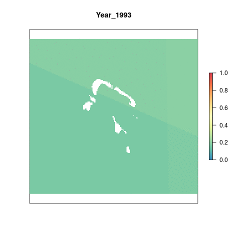

# Summary 

The sea level rise (SLR) pressure layer for Tetiaroa is derived from a global raster of monthly data indicating mean sea level anomalies from 1993 to 2019. This preparation script does the following for newly available global SLR data:
  
- Clips all output raster to the coast using a 3 nautical mile offshore buffer
- Resamples raster to ~ 1km^2^ and reprojects to Lambert azimuthal equal-area projection

This process is completed entirely within this script. The raw data is downloaded externally and held on a server at NCEAS. Although the raw data is not provided, this script can be used on the data downloaded from Aviso [here](https://www.aviso.altimetry.fr/data/products/sea-surface-height-products/global/gridded-sea-level-anomalies-mean-and-climatology.html). You will need to register with Aviso in order to get a username and password for data access.

***

# Data Source

The source data are monthly mean sea level anomalies, in meters. These anomalies are calculated by subtracting the current absolute sea level for each month from the average sea level for that month calculated from 1993 - 2019.

**Reference**: AVISO [Monthly mean Maps of Sea Level Anomaly](https://www.aviso.altimetry.fr/data/products/sea-surface-height-products/global/gridded-sea-level-anomalies-mean-and-climatology.html)

**Downloaded**: 

**Description**: Monthly mean sea level anomaly (meters above mean sea level)

**Native data resolution**: 0.25 degree grid cells

**Time range**: January 1993 - 20??, monthly data provided for each year

**Format**: NetCDF

***

# Setup 

```{r setup, message = F, warning = F}

knitr::opts_chunk$set(fig.width = 10, fig.height = 8, fig.path = 'figs/', message = FALSE, warning = FALSE)

library(raster)
library(tidyverse)
library(sf)
library(RColorBrewer)
library(googleVis)
library(foreach)
library(doParallel)
library(fasterize)
library(rasterVis)
library(animation)
library(mapview)
library(here)

# Source and set file paths
source(here('workflow/R/common.R'))

```

***

# Methods

## Load in SLR data files

We don't need to download the data from the AVISO website because it's already been downloaded for the most recent year of global. So we can just grab the NetCDF files from the global folder.

```{r read_files}

# d2016/msla_monthly_mean has data for 1993-2015
# Then include list.files for d2017 through the data folder for current scenario year
slr_gl_files <- c(list.files(file.path(dir_M, "git-annex/globalprep/prs_slr/v2020/output"),
                       full.names = TRUE, pattern = ".tif"),
              list.files(file.path(dir_M, "git-annex/globalprep/_raw_data/AVISO_slr/d2019"),
                       full.names = TRUE, pattern = ".nc"),
              list.files(file.path(dir_M, "git-annex/globalprep/_raw_data/AVISO_slr/d2018"),
                       full.names = TRUE, pattern = ".nc"),
              list.files(file.path(dir_M, "git-annex/globalprep/_raw_data/AVISO_slr/d2017"),
                       full.names = TRUE, pattern = ".nc"),
              list.files(file.path(dir_M, "git-annex/globalprep/_raw_data/AVISO_slr/d2016/msla_monthly_mean"),
                      full.names = TRUE, pattern = ".nc"))

slr_nc_files <- slr_nc_files[-1:-2] # Double check this, but since the first two files are zip files I am confident in removing them. However, I did grab it directly from the most recent version of global so I so still want to make sure it's correct

slr_gl_files <- list.files(file.path(dir_M, "git-annex/globalprep/prs_slr/v2020/output"),
                       full.names = TRUE, pattern = ".tif")

```

A peek into what the monthly data looks like, and also the global data

```{r explore_monthly}

plot(raster(slr_nc_files[1]), col = cols, axes = F, 
     main = paste("Year", substr(slr_nc_files[3], 90, 93), "Month", substr(slr_nc_files[3], 96, 97)))

```

## Convert .tif files into usable rasters

The following code is used to:

1. Rasterize each monthly NetCDF file
2. Rotate each raster so that the Atlantic Ocean is centered in the raster, and changes the extent from 0 to 360 to -180 to 180, which is needed when using wgs or us_albers projections/extents (any equal area, like azim_eq?)

```{r rasterize_monthly, results = 'hide'}

## Created 'msla_annual_mean', 'msla_annual_azimuthal', 'msla_annual_azimuthal_coastal', and 'msla_monthly' folders in 'int'

registerDoParallel(10)

## Parallel forloop function that rotates each monthly file, sets the long/lat projection, and keeps only coastal cells - saved to GitHub
foreach(file = slr_nc_files) %dopar% {
  #file = slr_nc_files[1]
  m_yr <- substr(file, nchar(file)-10, nchar(file)-3) 
  
  ## Read in month raster
  r <- raster(file) %>% 
    rotate()
  
  ## Define projection of the raster before reprojecting; double check projection
  
  ##question - should this crop by the one for the region?
  
  r <- raster::crop(r, wgs_ext) # Current projection is wgs84
  
  ## Write raster to int folder in prs_slr
  fp <- sprintf("%s/prs_slr/int/msla_monthly/msla_monthly_%s.tif", dir_anx, m_yr)
  writeRaster(r, filename = fp, overwrite = TRUE)
}

plot(r)
```

## Calculate annual mean sea level anomalies

Annual mean sea level anomaly rasters are calculated from the monthly data.

```{r calc_annual_mean, results='hide'}

msla_files <- list.files(sprintf("%s/prs_slr/int/msla_monthly", dir_anx), 
                         full.names = TRUE)
maxyr <- substr(msla_files, 93, 96) %>% as.numeric() %>% max() #note this changed for Tetiaroa

## Stack all rasters for this year, and calculate annual mean, then write as raster
registerDoParallel(6)
foreach(yr = c(1993:maxyr)) %dopar% {
  
  files <- msla_files[str_detect(msla_files, as.character(yr))]
  
  rast_annual_mean <- stack(files) %>%
    calc(mean, na.rm = TRUE) %>%
    writeRaster(filename = sprintf("%s/prs_slr/int/msla_annual_mean/msla_annual_%s.tif", dir_anx, yr), 
                overwrite = TRUE)
}

```


## Change the projection and mask

Since we are only interested in the increase in sea level near the coasts, we apply a mask to the raster layers that removes all cells farther than 3nm offshore. This mask was created previously for another part of this assessment. We also reproject to Lambert azimuthal equal-area projection.

```{r projection_masking, results = 'hide'}

## 3nm offshore raster to select only nearshore cells
three_nm <- raster(file.path(dir_github, "spatial/rasters/ocean_ras_100.tif"))
three_nm <- raster::crop(three_nm, azim_ext) # Crop to Tetiaroa extent
plot(three_nm)

## Reproject means to azimuthal equal-area
annual_means <- list.files(file.path(dir_anx, "prs_slr/int/msla_annual_mean"), full = TRUE)
foreach(file = annual_means) %dopar% {  
  
 file = annual_means[26]
  yr <- str_sub(file, -8, -5)
  
  rast_data <- raster(file) %>%
    projectRaster(crs = azim_eq, over = FALSE, progress="text") %>% #this is where its failing
    raster::resample(three_nm, method = "ngb", 
             filename = sprintf("%s/prs_slr/int/msla_annual_azimuthal/mlsa_annual_azimuthal_%s.tif", 
                                dir_anx, yr), overwrite = TRUE) %>% 
    mask(three_nm, filename = sprintf("%s/prs_slr/int/msla_annual_azimuthal_coastal/msla_annual_azimuthal_coastal_%s.tif", dir_anx, yr), overwrite = TRUE)
}
plot(raster(file.path(dir_anx, "prs_slr/int/msla_annual_azimuthal_coastal/msla_annual_azimuthal_coastal_2010.tif")))

plot(rast_data)

```


## Reference point

We are using a reference point 1.1 times larger than the maximum value in Tetiaroa from 1993-2019. The current maximum value is unlikely to be the future max, and setting this reference point allows for an increase in sea level rise pressure into the future.

```{r reference_point}

coastal_rasts <- list.files(file.path(dir_anx, "prs_slr/int/msla_annual_azimuthal_coastal"), pattern = "tif", full.names = TRUE)

# Get data across all years
registerDoParallel(8)

vals <- foreach(i = 1993:2019, .combine = c) %dopar% { 
  
  # i = 2017
  coastal_rasts[which(str_sub(coastal_rasts, -8, -5) == i)] %>%
    raster() %>%
    getValues() %>%
    na.omit()
  
}

ref <- 1.1*max(vals)

```

The reference point is `r ref` meters.


## Rescale

We use the reference point to rescale all values from 0 to 1. If a value is greater than the reference point, it is automatically given a value of 1.

```{r rescale, results='hide'}

registerDoParallel(10) 

foreach(file = coastal_rasts) %dopar% { # file = coastal_rasts[10]
  yr <- str_sub(file, -8,-5)
    raster::raster(file) %>%
    calc(fun = function(x){ifelse(x < 0, 0, x)}) %>% # Set all negative values to 0
    calc(fun = function(x){ifelse(x > ref, 1, x/ref)}, # Set equal to 1 if greater than ref, otherwise scale
         filename = sprintf("%s/prs_slr/output/msla_rescaled/slr_%s.tif", dir_anx, yr), overwrite = TRUE)
}

```

***

# Results

```{r gif_results}

coastal_rasts <- list.files(file.path(dir_anx, 'prs_slr/output/msla_rescaled'), full.names = T) %>%
                           stack()
                         
names(coastal_rasts) <- paste0("Year_", substr(names(coastal_rasts),5,8))

# Make a gif animation
animation::saveGIF({
  for(i in 1:nlayers(coastal_rasts)){
     plot(coastal_rasts[[i]], col='cornsilk2', main=names(coastal_rasts[[i]]), axes=F, legend=F)
      # don't forget to fix the zlimits
    plot(coastal_rasts[[i]], zlim=c(0,1), axes=F, col=cols, add=T)
      
  }
}, movie.name = 'slr_annual_rescaled.gif')

```




## Region scores

Extract data for each region

```{r extract_regional_data, results = 'hide'}

## Read in raster files
pressure_stack <- lapply(list.files(file.path(dir_anx, 'prs_slr/output/msla_rescaled'), full.names=T), raster) %>%
  brick()

## Extract data for each region:
regions_stats <- zonal(pressure_stack,  zones, fun="mean", na.rm=TRUE, progress="text")
regions_stats2 <- data.frame(regions_stats)
data <- base::merge(rgn_data, regions_stats, all.y=TRUE, by.x="rgn_id", by.y="zone") %>%
          dplyr::select(-area_km2)%>%
  gather("year", "pressure_score",starts_with("slr_")) 
slr_data_int <- data %>%
  mutate(year = substr(year, 5, 8)) %>%
  mutate(year = as.numeric(year))

```

Extract data for the region as a whole

```{r extract_region_data}

## Read in raster files
pressure_stack <- lapply(list.files(file.path(dir_anx, 'prs_slr/output/msla_rescaled'), full.names=T), raster) %>%
  brick()
tet_regionstats <- cellStats(pressure_stack, mean)%>% 
  as.data.frame() %>% 
  rename(pressure_score = ".") %>% 
  tibble::rownames_to_column("file_name") %>% 
  mutate(year = substr(file_name, 5, 8)) %>% 
  select(-file_name) %>% 
  mutate(rgn_id = 12, # Change to Tetiaroa region - what rgn_id is it?
         rgn_name = "Northeast", # Change this
         state_abv = NA,
         state_name = NA,
         state = "Northeast", # Change this
         year = as.numeric(year))

```

Save data

```{r save}

slr_data <- rbind(slr_data_int, tet_regionstats) %>% 
  select(rgn_id, rgn_name, year, pressure_score) %>% 
  filter(year >= 2005 & year <= 2019)
write.csv(slr_data, file.path("~/github/tet-scores/region/layers/cc_slr.csv"), row.names=FALSE)

```


## 2019 scores

```{r map_scores}

last_year <- slr_data %>%
  filter(year==2019,
         rgn_id != 12) # Change to Tetiaroa region ID

## map_scores is a function to plot a tmap map of the scores
map_scores(last_year, score_var = last_year$pressure_score, scale_label = "Pressure Score", map_title = "Sea Level Rise")

```


## Visualize through time

```{r graph_scores_overtime}

slr_overtime <-ggplot(slr_data)+
  geom_line(aes(x=year, y = pressure_score, color=rgn_name))+
  ggtitle("Sea Level Rise Pressure Score") +
  ylab("Score") +
  xlab("Year") +
  theme_classic() 
slr_overtime
ggsave(file.path(dir_git, "prep/pressures/slr/v2020/figs/scores_2005-2019.png"), width=7, height=5, dpi=300)

```


## Save To Toolbox

```{r save-to-toolbox, eval=F}

```
