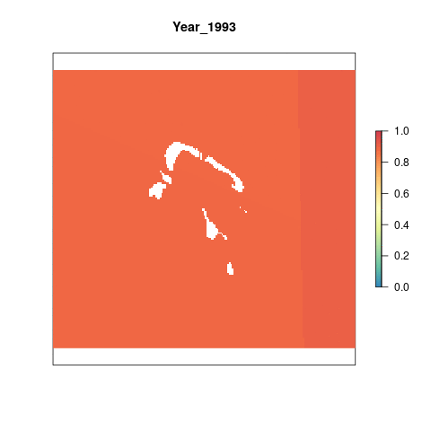

# Summary 

The sea level rise (SLR) pressure layer for Tetiaroa is derived from a global raster of monthly data indicating mean sea level anomalies from 1993 to 2019. This preparation script does the following for newly available global SLR data:
  
- Clips all output raster to the coast using a 3 nautical mile offshore buffer
- Resamples raster to ~ 1km^2^ and reprojects to Lambert azimuthal equal-area projection

This process is completed entirely within this script. The raw data is downloaded externally and held on a server at NCEAS. Although the raw data is not provided, this script can be used on the data downloaded from Aviso [here](https://www.aviso.altimetry.fr/data/products/sea-surface-height-products/global/gridded-sea-level-anomalies-mean-and-climatology.html). You will need to register with Aviso in order to get a username and password for data access.

***

# Data Source

The source data are monthly mean sea level anomalies, in meters. These anomalies are calculated by subtracting the current absolute sea level for each month from the average sea level for that month calculated from 1993 - 2019.

**Reference**: AVISO [Monthly mean Maps of Sea Level Anomaly](https://www.aviso.altimetry.fr/data/products/sea-surface-height-products/global/gridded-sea-level-anomalies-mean-and-climatology.html)

**Downloaded**: 

**Description**: Monthly mean sea level anomaly (meters above mean sea level)

**Native data resolution**: 0.25 degree grid cells

**Time range**: January 1993 - 20??, monthly data provided for each year

**Format**: NetCDF

***

# Setup 

```{r setup, message = F, warning = F}

knitr::opts_chunk$set(fig.width = 10, fig.height = 8, fig.path = 'figs/', message = FALSE, warning = FALSE)

library(raster)
library(tidyverse)
library(sf)
library(RColorBrewer)
library(googleVis)
library(foreach)
library(doParallel)
library(fasterize)
library(rasterVis)
library(animation)
library(mapview)
library(here)

# Source and set file paths
source(here('workflow/R/common.R'))
```


# Methods

## Load in SLR data files

We don't need to download the data from the AVISO website because it's already been downloaded and processed for the most recent year of global. Lets grab the output files and look at those.

```{r}


slr_gl_files <- list.files(file.path(dir_M, "git-annex/globalprep/prs_slr/v2020/output"),
                       full.names = TRUE, pattern = ".tif")

plot(raster(slr_gl_files[1]), col = cols, axes = F, 
     main = paste("Year", substr(slr_gl_files[1], 5, 8))) #wont work
```

This has already been cropped, so lets grab the annual mean files instead:

```{r}

slr_msla_annual_files <- list.files(file.path(dir_M, "git-annex/globalprep/prs_slr/v2020/int/msla_annual_mean"),
                       full.names = TRUE, pattern = ".tif")

plot(raster(slr_msla_annual_files[1]), col = cols, axes = F, 
     main = paste("Year", substr(slr_msla_annual_files[1], -8, -5)))
```

## Change the projection and mask

Since we are only interested in the increase in sea level around Tetiaroa, we apply a mask to the raster layers that removes all cells farther than 3nm offshore. This mask was created previously for another part of this assessment. We also reproject to Lambert azimuthal equal-area projection.

```{r}

## 3nm offshore raster to select only nearshore cells
three_nm <- raster(file.path(dir_github, "spatial/rasters/ocean_ras_100.tif"))
three_nm <- raster::crop(three_nm, azim_ext) # Crop to Tetiaroa extent
plot(three_nm)

## Reproject means to azimuthal equal-area
#annual_means <- list.files(file.path(dir_anx, "prs_slr/int/msla_annual_mean"), full = TRUE)
foreach(file = slr_msla_annual_files) %dopar% {  
  
 #file = slr_msla_annual_files[26]
  yr <- str_sub(file, -8, -5)
  
  rast_data <- raster(file) %>%
    projectRaster(from = rast_data, to = three_nm, crs = azim_eq, method = "ngb", over = FALSE, progress="text") %>% #this is where its failing
    #raster::resample(three_nm, method = "ngb", 
             #filename = sprintf("%s/prs_slr/int/msla_annual_azimuthal/mlsa_annual_azimuthal_%s.tif", 
                                #dir_anx, yr), overwrite = TRUE) %>% 
    mask(three_nm, filename = sprintf("%s/prs_slr/int/msla_annual_azimuthal_coastal/msla_annual_azimuthal_coastal_%s.tif", dir_anx, yr), overwrite = TRUE)
}

plot(raster(file.path(dir_anx, "prs_slr/int/msla_annual_azimuthal_coastal/msla_annual_azimuthal_coastal_2010.tif")))


```

## Reference point

We are using a reference point 1.1 times larger than the maximum value in Tetiaroa from 1993-2018. The current maximum value is unlikely to be the future max, and setting this reference point allows for an increase in sea level rise pressure into the future.

```{r reference_point}

coastal_rasts <- list.files(file.path(dir_anx, "prs_slr/int/msla_annual_azimuthal_coastal"), pattern = "tif", full.names = TRUE)

# Get data across all years
registerDoParallel(8)

vals <- foreach(i = 1993:2018, .combine = c) %dopar% { 
  
  # i = 2017
  coastal_rasts[which(str_sub(coastal_rasts, -8, -5) == i)] %>%
    raster() %>%
    getValues() %>%
    na.omit()
  
}

ref <- 1.1*max(vals)

```

The reference point is `r ref` meters.

## Rescale

We use the reference point to rescale all values from 0 to 1. If a value is greater than the reference point, it is automatically given a value of 1.

```{r rescale, results='hide'}

registerDoParallel(10) 

foreach(file = coastal_rasts) %dopar% { # file = coastal_rasts[10]
  yr <- str_sub(file, -8,-5)
    raster::raster(file) %>%
    calc(fun = function(x){ifelse(x < 0, 0, x)}) %>% # Set all negative values to 0
    calc(fun = function(x){ifelse(x > ref, 1, x/ref)}, # Set equal to 1 if greater than ref, otherwise scale
         filename = sprintf("%s/prs_slr/output/msla_rescaled/slr_%s.tif", dir_anx, yr), overwrite = TRUE)
}


plot(raster(file.path(dir_anx, "prs_slr/output/msla_rescaled/slr_2010.tif")))
```

***

# Results

```{r gif_results}

coastal_rasts <- list.files(file.path(dir_anx, 'prs_slr/output/msla_rescaled'), full.names = T) %>%
                           stack()
                         
names(coastal_rasts) <- paste0("Year_", substr(names(coastal_rasts),5,8))

# Make a gif animation
animation::saveGIF({
  for(i in 1:nlayers(coastal_rasts)){
     plot(coastal_rasts[[i]], col='cornsilk2', main=names(coastal_rasts[[i]]), axes=F, legend=F)
      # don't forget to fix the zlimits
    plot(coastal_rasts[[i]], zlim=c(0,1), axes=F, col=cols, add=T)
      
  }
}, movie.name = 'slr_annual_rescaled.gif')

```

