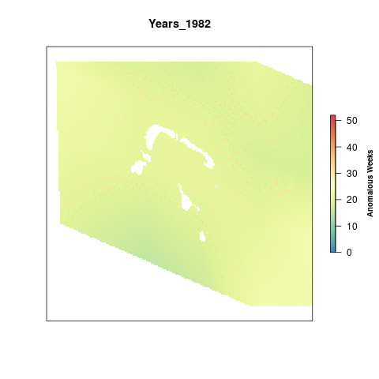

#Summary

For OHI Global Assessments, we calculated a climatology from 1982-2017 per cell using weekly data from CorTAD. We then calculated the number of times a given cell's weekly SST was greater than the climatological mean for that week (an anomaly: greater than mean + one standard deviation) and summed the number of weekly anomalies in a single year. The maximum value a cell could have is 52 which would mean that cell had anomalous SST temperatures for each week of the year.

To account for annual variation, we look at Sea Surface Temperature anomalies in 5 year periods, so the maximum value possible per cell is 260 anomalous weeks. To rescale the values from 0 to 1 we set a reference point. Previously, the reference point for SST has just been the maximum difference in anomalous weeks between the most recent time period and a historical reference period (1985-1989).

**Tetiaroa** - need to decide on a reference point

***

# Data

**Source**: The [Coral Reef Temperature Anomaly Database Version 6 (CoRTAD)](https://data.nodc.noaa.gov/cgi-bin/iso?id=gov.noaa.nodc:0175483)  
**Downloaded**: August 21, 2018  
**Description**:  Sea Surface Temperature Anomalies (Kelvin)  
**Native data resolution**: 4km^2^    
**Time range**: 1982 - 2017  
**Format**:  NetCDF  

***
# Set Up
``` {r setup, echo = FALSE, message = FALSE, warning = FALSE, results = "hide"}
knitr::opts_chunk$set(fig.width = 8, fig.height = 6, fig.path = 'figs/', message = FALSE, warning = FALSE)

library(raster)
library(doParallel)
library(foreach)

source(here('workflow/R/common.R'))
```

# Analysis
## Global data layers

We're going to use the global data that was processed for OHI 2018. This data is held on a server at NCEAS.

Each of these rasters is the number of positive weekly anomalies each year.

```{r global_data}
sst_global_files <- list.files(file.path(dir_M,'git-annex/globalprep/prs_sst/v2018/int'), pattern = 'annual_pos_anomalies', full.names=T)


annomalies <- sst_global_files[[36]]

plot(raster("/home/shares/ohi/git-annex/globalprep/prs_sst/v2018/int/annual_pos_anomalies_sd_1985.tif"), main = "Sea Surface Temperature 2017", box=F,axes=F,
     legend.args=list(text='Anomalous Weeks', side=4, font=2, line=2.5, cex=0.8)) #note: got rid of cols = cols 
```

## Crop to the Tetiaroa region

```{r crop_to_tet, eval = F}

#Jamie uses the doParallel package which allows parallel processes to run at the same time, helping speed up loops. You need to "register" this backend function using the code below, specifying # of cores

registerDoParallel(10)

#loop below kept breaking without a file.exists() test

foreach(f = sst_global_files) %dopar% {
  #f = sst_global_files[35]
  
  if(!file.exists(paste0(dir_anx,'/prs_sst/output/sst_annual_anoms/annual_anoms_', substr(basename(f), 25, 28),'.tif'))){
  
 raster(f)%>%                     #raster the file
    crop(wgs_ext)%>%               #crop to the WGS extent 
    projectRaster(tet_ocean_rast_100)%>%
    mask(tet_ocean_rast_100, filename = paste0(file.path(dir_anx),'/prs_sst/output/sst_annual_anoms/annual_anoms_', substr(basename(f), 25, 28),'.tif'), overwrite = F)
    }else{
    message('Raster exists')
  }
}

#plot(raster(file.path(dir_anx, 'prs_sst/output/sst_annual_anoms/annual_anoms_2017.tif')),col=cols, axes=F, main = "Sea Surface Temperature 2017",
     #legend.args=list(text='Anomalous Weeks', side=4, font=2, line=2.5, cex=0.8))


```
Note: this is not working quite the way it should, only able to do the following years: 
-

## Visualize change over time

This is something Jamie had in northeast, cool way to create animation showing change by creating a GIF

```{r gif1, eval = F}

#rasterize each file in the list of files and then create a brick of rasters

s <- lapply(list.files(file.path(dir_anx, 'prs_sst/output/sst_annual_anoms'), full.names=T), raster) %>%
  brick()

names(s) <- paste0("Years_",(substr(names(s), 14, 17))) #rename each layer for plotting
gsub(".", "-", names(s), fixed = TRUE)                #replace the . with a -

library(animation)

#have not run this yet
saveGIF({
  for(i in 1:nlayers(s)){
      # don't forget to fix the zlimits
      plot(s[[i]], zlim=c(0,52), axes=F, col=cols,
           main=names(s[[i]]),
           legend.args=list(text='Anomalous Weeks', side=4, font=2, line=2.5, cex=0.8))
      
  }
}, movie.name = 'sst_annual_anoms.gif')
```



## Five year aggregates

Calculating total anomalous weeks for each 5 year period from 1982 - 2017

```{r five-year, eval=F}

l <- list.files(file.path(dir_anx, 'prs_sst/output/sst_annual_anoms'), full.names = T)

for(i in 1982:2013){ 
  i = 2005
  
  yrs <- c(i, i+1, i+2, i+3, i+4) #group 5 years
  s <- raster::stack(l[substr(l,100,103) %in% yrs]) %>% 
    sum(.)
  
  writeRaster(s, filename = paste0(dir_anx, '/prs_sst/output/sst_5yr_anom_sums/sum_anoms_', min(yrs), '-', max(yrs), '.tif'), overwrite=T)
}


```

## Rescale

To account for annual variation, we look at Sea Surface Temperature anomalies in 5 year periods, so the maximum value possible per cell is 260 anomalous weeks. To rescale the values from 0 to 1 we need to set a reference point. Previously, the reference point for SST has just been the maximum difference in anomalous weeks between the most recent time period and a historical reference period (1985-1989).

From NorthEast: This time we have decided to use a reference point that represents a regime shift. Once a given cell is anomalous for more than 50% of a five-year period, it has shifted into a new regime. All cells that have a value greater than 130 weeks (51% of a 5 year time period) are assigned a 1. The rest of the cells are scaled to this reference point by dividing by 130.

```{r rescale, eval = F}

sst_aggs <- list.files(file.path(dir_anx, 'prs_sst/output/sst_5yr_anom_sums'), full.names=T) 


resc_func <- function(x){
 x <- sst_aggs[32]
  #get the year from the file for naming the output raster
  yrs <- substr(x, 98, 106)
 
  #if a cell value is greater than or equal to the reference point (130 weeks), we assign a value of 1, otherwise it is divided by the reference point
  raster(x)%>%
  calc(., fun=function(x){ifelse(x < 0, 0, ifelse(x > 130, 1, x/130))},
         filename = paste0(dir_anx, '/prs_sst/output/sst_rescale/sst_rescale_', yrs, '.tif'), overwrite=T)
}

foreach(file = sst_aggs) %dopar%{
  resc_func(file)
}

#note, this was getting hung up on the last one (2013-2017) so I just added it manually to the folder
```


***

## Citations
Saha, Korak; Zhao, Xuepeng; Zhang, Huai-min; Casey, Kenneth S.; Zhang, Dexin; Zhang, Yongsheng; Baker-Yeboah, Sheekela; Relph, John M.; Krishnan, Ajay; Ryan, Thomas (2018). The Coral Reef Temperature Anomaly Database (CoRTAD) Version 6 - Global, 4 km Sea Surface Temperature and Related Thermal Stress Metrics for 1982 to 2017. NOAA National Centers for Environmental Information. Dataset. https://doi.org/10.25921/ffw7-cs39. Accessed: August 21, 2018/

Selig, E.R., K.S. Casey, and J.F. Bruno (2010), New insights into global patterns of ocean temperature anomalies: implications for coral reef health and management, Global Ecology and Biogeography, DOI: 10.1111/j.1466-8238.2009.00522.x.