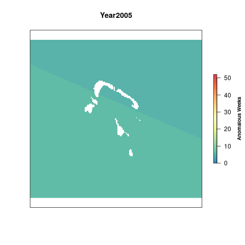
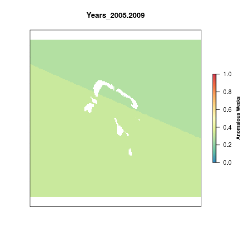

# Summary

The Ultraviolet Radiation pressure layer is generated from daily data on Local Noon Erythemal UV Irradiance (mW/m2) derived from satellite observations. 

For the global OHI assessment, the raw data is processed into anomaly products. The data product of that process are rasters of total number of weekly anomalies per year. An anomaly is defined as greater than the mean climatology plus 1 standard deviation for that cell across the entire dataset (2005-2016).

This script takes the global anomaly rasters, crops them to the Northeast region. This time we have decided to use a reference point that represents a regime shift. Once a given cell is anomalous for more than 50% of a five-year period, it has shifted into a new regime. All cells that have a value greater than 130 weeks (51% of a 5 year time period) are assigned a 1. The rest of the cells are scaled to this reference point by dividing by 130.

***

# Data

**Reference**: The Ultraviolet Radiation pressures layer uses the [Aura OMI GLobal Surface UVB Data Product](https://disc.gsfc.nasa.gov/uui/datasets/OMUVBG_V003/summary#).  
**Native Data Resolution**: 0.25 degrees  
**Values**: OMI/Aura Surface UVB Irradiance and Erythemal Dose Daily L2 Global Gridded 0.25 degree x 0.25 degree V3  
**Time Range**: Daily data from 2005 - 2016  
**Format**: HDF5

```{r setup, include=FALSE}
knitr::opts_chunk$set(echo = TRUE, warning = FALSE, message = FALSE, eval = FALSE)


library(raster)
library(doParallel)
library(foreach)
library(here)

source(here('workflow/R/common.R'))

```

# Analysis 

## Global Data 

We will use the global data that was processed for OHI 2020, which includes 2005 - 2019. 

First, find the layers from Mazu that will be clipped to the Tetiaroa area

```{r globa_uv_data}


anom_files <- list.files(file.path(dir_M, 'git-annex/globalprep/prs_uv/v2020/int/annual_anomalies_diff'), pattern = "annual_pos", full.names = T) #double check these are the right ones

library(rworldmap)
world = getMap()

#plot most recent year
plot(raster(anom_files[15]), col=cols, main = "UV Radiation Anomalies 2019", box=F, axes=F,
     legend.args=list(text='Anomalous Weeks', side=4, font=2, line=2.5, cex=0.8))
plot(world, col='black', add=T)

```

## Crop to Tetiaroa

Using the `crop` function from the `raster` package we crop all uv rasters to our extent and then reproject them to the Azim World projection for consistency across the assessment. We crop the global rasters first to reduce the time it takes to reproject the rasters. `tet_ocean_rast_100` is used as a mask to remove land cells from the raster for better visuals.


```{r crop_to_tet, eval=F}

registerDoParallel(10) #register 8 cores for parallel processing (actually 10)

foreach(f = anom_files) %dopar% {
  #f = anom_files[15]
  
  if(!file.exists(paste0(dir_anx,'/prs_uv/output/uv_annual_anoms/1_new_annual_anom_', substr(basename(f), 22, 25),'.tif'))){
  raster(f)%>%
    projectRaster(tet_ocean_rast_100, method = 'ngb')%>%
    crop(azim_ext)%>%  #the Tetiaroa region in wgs projection
    mask(tet_ocean_rast_100, filename = paste0(dir_anx, '/prs_uv/output/uv_annual_anoms/annual_anom_', substr(basename(f), 22, 25),'.tif'),overwrite=T)
  }else{
    message("Raster exists")
  }
}

f = anom_files[15]
  
 test <-  raster(f)%>%
   projectRaster(tet_ocean_rast_100, method = 'ngb') %>% 
    crop(azim_ext)  #the Tetiaroa region in wgs projection
    

plot(raster(file.path(dir_anx, 'prs_uv/output/uv_annual_anoms/annual_anom_2007.tif')), col=cols, 
     main = "Ultraviolet Radiation 2016", legend.args=list(text='Anomalous Weeks', side=4, font=2, line=2.5, cex=0.8))
  
plot(wgs_ext)
plot(tet_ocean_rast_100)
plot(test)
```

## Visualize change over time 

```{r gif1, eval=F}


l <- lapply(list.files(file.path(dir_anx, "prs_uv/output/uv_annual_anoms"), full.names=T), raster)%>%
                brick()
names(l) <- paste0("Year", (substr(names(l),13,16))) #rename each layer for plotting

library(animation)
saveGIF({
  for(i in 1:nlayers(l)){
      # don't forget to fix the zlimits
      plot(l[[i]], zlim=c(0,52), axes=F, col=cols,
           main=names(l[[i]]),
           legend.args=list(text='Anomalous Weeks', side=4, font=2, line=2.5, cex=0.8))
      
  }
}, movie.name = 'uv_annual_anoms.gif')


```



## Five-year aggregates

Calculating total anomalous weeks for each 5-year period from 2005 - 2016
```{r, five-year, eval= F}

l <- list.files(file.path(dir_anx, "prs_uv/output/uv_annual_anoms"), full.names=T)
for(i in 2005:2019){ #i=2005
  
  yrs <- c(i,i+1,i+2,i+3,i+4)
  s   <- stack(l[substr(basename(l), 13, 16)%in%yrs]) %>%
    sum(.)
  
  writeRaster(s, filename = paste0(dir_anx, "/prs_uv/output/uv_sum_anoms/sum_anoms_", min(yrs), '-', max(yrs), '.tif'), overwrite=T)
}


```

## Rescale

To account for annual variation, we look at UV anomalies in 5 year periods, so the maximum value possible per cell is 260 anomalous weeks. To rescale the values from 0 to 1 we need to set a reference point. Previously, the reference point for UV has just been the maximum difference in anomalous weeks between the most recent time period and a historical reference period (2005-2009).

This time we have decided to use a reference point that represents a regime shift. Once a given cell is anomalous for more than 50% of a five-year period, it has shifted into a new regime. All cells that have a value greater than 130 weeks (51% of a 5 year time period) are assigned a 1. The rest of the cells are scaled to this reference point by dividing by 130.

```{r rescale, eval = F}

uv_aggs <- list.files(file.path(dir_anx, "prs_uv/output/uv_sum_anoms"), full.names=T)

resc_func <- function(x){
  
  #get the year from the file for naming the output raster
  yrs <- substr(basename(x), 11, 19)
 
  #if a cell value is greater than or equal to the reference point (130 weeks), we assign a value of 1, otherwise it is divided by the reference point
  raster(x)%>%
  calc(.,fun=function(x){ifelse(x<0, 0, ifelse(x>130, 1, x/130))},
         filename = paste0(dir_anx, '/prs_uv/output/uv_rescaled/uv_rescale_', yrs, '.tif'), overwrite=T)
}
foreach(file = uv_aggs) %dopar% {
  resc_func(file)
}

```

### Presure over time

```{r gif_rescale, eval = F}

#list the rescaled rasters and assign them in a brick
resc      <- lapply(list.files(file.path(dir_anx, 'prs_uv/output/uv_rescaled'), full.names=T), raster) %>%
                      brick()
names(resc) <- paste0("Years_", (substr(names(resc), 12, 20)))
gsub(".", "-", names(resc), fixed = TRUE)

#create a gif of values over time
saveGIF({
  for(i in 1:nlayers(resc)){
      # don't forget to fix the zlimits
      plot(resc[[i]], zlim=c(0,1), axes=F, col=cols,
           main=names(resc[[i]]),
           legend.args=list(text='Anomalous Weeks', side=4, font=2, line=2.5, cex=0.8))
      
  }
}, movie.name = 'uv_rescale.gif')


```

. 

***

# Results

## Scores

```{r}

# read in rescaled files
uv_stack <- lapply(list.files(file.path(dir_anx, 'prs_uv/output/uv_rescaled'),full.names=T), raster) %>%
  brick()

#find the mean 
tet_stats <- zonal(uv_stack,  tet_ocean_rast_100, fun="mean", na.rm=TRUE, progress="text") %>%
                  data.frame() %>% 
  clean_names()

#convert into a data frame, add additional columns

uv_data <- pivot_longer(tet_stats, cols = uv_rescale_2005_2009:uv_rescale_2015_2019 , names_to = "years", values_to = "pressure_score") %>% 
  mutate(
    year = substr(years,17,20),
    year = as.numeric(year)
  ) %>% 
  dplyr::select(region_id = zone, year, pressure_score)

```

# Save to toolbox and output

```{r save}

write.csv(uv_data, file.path(dir_github, "prep/pressures/uv/v2020/output/uv_data.csv"))

uv_clean <- read_csv(file.path(dir_github, "prep/pressures/uv/v2020/output/uv_data.csv")) %>% 
  dplyr::select(region_id, year, pressure_score) %>% 
  filter(year > 2013)

write.csv(uv_clean, file.path(dir_scores, "/region/layers/prs_uv.csv"))
```
